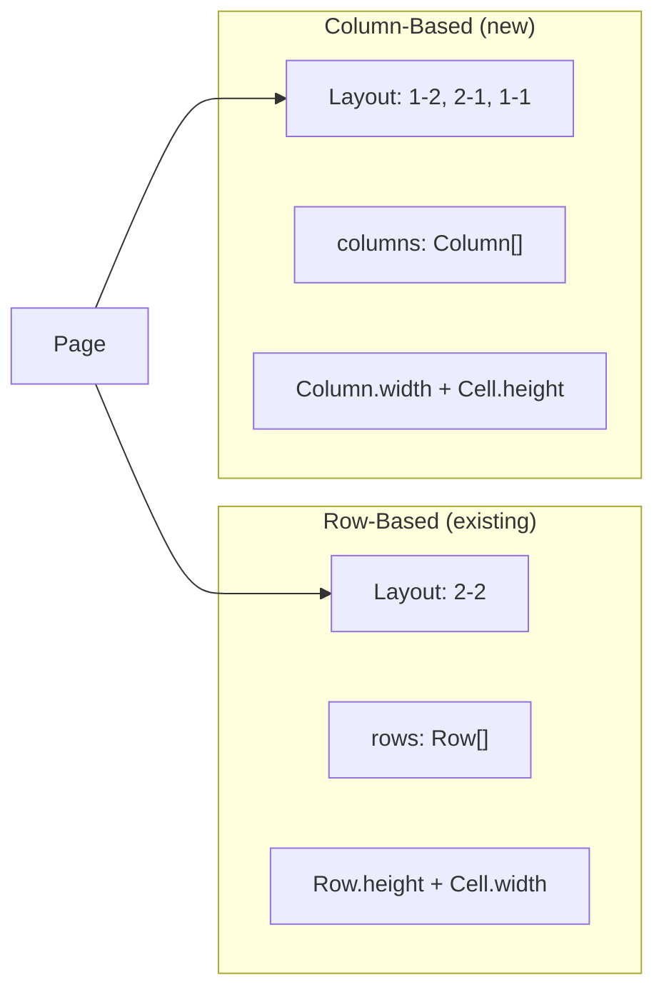

# Add Column-Based Layout Support

## Data Model Changes

### New Types in [`app/src/types.ts`](app/src/types.ts)

Add a `Column` interface mirroring the existing `Row`:

```typescript
export interface Column {
  width: number
  cells: Cell[]  // cells stacked vertically within the column
}
```

Update `Cell` to support both width (row-based) and height (column-based):

```typescript
export interface Cell {
  width?: number   // used in row-based layouts
  height?: number  // used in column-based layouts
  path?: string
  // ... rest unchanged
}
```

Update `Page` to have either rows OR columns:

```typescript
export interface Page {
  id: string
  layout: LayoutType
  rows?: Row[]      // for row-based layouts ('1', '2-2', '2-3', '3-2')
  columns?: Column[] // for column-based layouts ('1-1', '1-2', '2-1')
}
```

### Config Updates in [`app/src/config.ts`](app/src/config.ts)

Extend `LayoutType` and add column layout definitions:

```typescript
export type LayoutType = '1' | '2-2' | '2-3' | '3-2' | '1-1' | '1-2' | '2-1'

export const ROW_LAYOUTS: Record<string, number[]> = {
  '1': [1],
  '2-2': [2, 2],
  '2-3': [2, 3],
  '3-2': [3, 2],
}

export const COLUMN_LAYOUTS: Record<string, number[]> = {
  '1-1': [1, 1],   // 2 columns, 1 cell each (full height)
  '1-2': [1, 2],   // 2 columns: left=1 full height, right=2 half height
  '2-1': [2, 1],   // 2 columns: left=2 half height, right=1 full height
}

export function isColumnLayout(layout: LayoutType): boolean {
  return layout in COLUMN_LAYOUTS
}
```

Add helper functions for column dimensions:
- `calculateDefaultColumnWidths(colCount)` - similar to row heights
- `calculateDefaultCellHeights(cellCount)` - similar to cell widths

---

## Frontend Changes

### [`app/src/composables/useFileSystem.ts`](app/src/composables/useFileSystem.ts)

Update `createPage()` to support column layouts by checking `isColumnLayout()` and creating `columns` instead of `rows`.

### [`app/src/components/PageComponent.vue`](app/src/components/PageComponent.vue)

1. Add column layouts to `availableLayouts` array
2. Conditionally render either rows (existing) or columns (new)
3. Update layout preview thumbnails to show column-based layouts correctly (flex-direction: row for column layouts)

### New Component: `ColumnComponent.vue`

Mirror `RowComponent.vue` but for vertical cell stacking:
- Takes `column: Column` prop
- Renders cells vertically with gutters between them
- Emits resize events for cell heights

### [`app/src/App.vue`](app/src/App.vue)

1. Update `handleChangeLayout()` to handle row-to-column and column-to-row transitions
2. Add column resize handlers mirroring row resize logic
3. Update `recalculateCropForCell()` to work with both structures
4. Update image iteration to check both `rows` and `columns`

---

## PDF Generator Changes

### [`pdf_generator/generate_pdf.py`](pdf_generator/generate_pdf.py)

1. Add `Column` TypedDict matching the frontend
2. Update `Page` TypedDict to have optional `rows` and `columns`
3. Add `is_column_layout()` helper
4. Update `generate_pdf()` rendering loop:

```python
if "columns" in page:
    # Iterate columns left-to-right, cells top-to-bottom
    for col_idx, col in enumerate(page["columns"]):
        col_width_mm = col["width"] * SCALE_FACTOR
        current_y = 0
        for cell_idx, cell in enumerate(col["cells"]):
            cell_height_mm = cell["height"] * SCALE_FACTOR
            # ... render cell at (current_x, current_y)
            current_y += cell_height_mm + PRINT_GUTTER
        current_x += col_width_mm + PRINT_GUTTER
else:
    # Existing row-based rendering
```

---

## album.json Format

Row-based (existing):
```json
{
  "layout": "2-2",
  "rows": [{ "height": 294, "cells": [{ "width": 360 }, ...] }, ...]
}
```

Column-based (new):
```json
{
  "layout": "1-2",
  "columns": [
    { "width": 360, "cells": [{ "height": 598 }] },
    { "width": 360, "cells": [{ "height": 294 }, { "height": 294 }] }
  ]
}
```

---

## Visual Diagram

