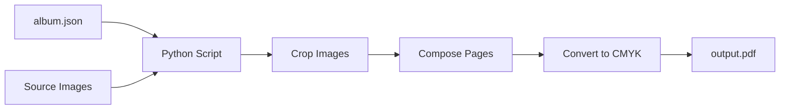

# PDF Generation Script for Photobook

## Overview

Build a Python CLI script that reads `album.json` from an image folder, applies identical cropping and layout logic to the Vue app, and generates a print-ready CMYK PDF with 356×296mm pages.

## Architecture



## Key Calculations

### Dimension Mapping (UI pixels to mm)

The UI uses 730×598px for a page. The print page is 356×296mm with 10mm margins:
- **Printable area**: 336×276mm (356-20 × 296-20)
- **Scale factor**: `336mm / 730px = 0.4603mm/px`
- **Gutter in mm**: `10px × 0.4603 = 4.6mm`

### DPI Calculation

For a cell of width W (in UI px), the print width is `W × 0.4603mm`.
The crop_width from album.json tells us how many source pixels we're using.
DPI = `(source_pixels / print_mm) × 25.4`

At minimum, with crop_width=1067px for a 360px cell (166mm print):
`(1067 / 166) × 25.4 ≈ 163 DPI` - borderline acceptable.

Larger cells or zoomed images will have higher DPI. We'll log warnings for images below 200 DPI.

### Cropping Logic

Port the exact `calculateCrop()` function from [`useCropCalculation.ts`](app/src/composables/useCropCalculation.ts):

```python
def calculate_crop(img_w, img_h, cell_w, cell_h, focal_x, focal_y, zoom):
    img_ar = img_w / img_h
    cell_ar = cell_w / cell_h
    
    # Cover crop at zoom=1.0
    if img_ar > cell_ar:
        base_crop_h = img_h
        base_crop_w = img_h * cell_ar
    else:
        base_crop_w = img_w
        base_crop_h = img_w / cell_ar
    
    # Apply zoom
    final_crop_w = base_crop_w / zoom
    final_crop_h = base_crop_h / zoom
    
    # Center on focal point
    crop_x = (focal_x * img_w) - final_crop_w / 2
    crop_y = (focal_y * img_h) - final_crop_h / 2
    
    # Clamp to bounds
    crop_x = max(0, min(crop_x, img_w - final_crop_w))
    crop_y = max(0, min(crop_y, img_h - final_crop_h))
    
    return crop_x, crop_y, final_crop_w, final_crop_h
```

## Project Structure

```
pdf_generator/
├── pyproject.toml          # uv/pip dependencies
├── generate_pdf.py         # Main CLI script
└── README.md               # Usage instructions
```

## Dependencies

- **Pillow**: Image loading, cropping, and high-quality resampling (LANCZOS)
- **ReportLab**: PDF generation with precise mm positioning
- **littlecms / pillow-cmyk**: CMYK color profile conversion

## Implementation Steps

### 1. Setup Python project with uv
Create `pyproject.toml` with dependencies: Pillow, ReportLab

### 2. Parse album.json and load images
Read JSON, load source images with Pillow, extract EXIF orientation

### 3. Port cropping algorithm
Implement `calculate_crop()` exactly matching the TypeScript version

### 4. Render pages to PDF
- Create 356×296mm pages with ReportLab
- Draw 10mm margin offset
- For each row/cell: crop image, resize with LANCZOS, place at calculated position
- Convert to CMYK before embedding

### 5. CLI interface
```bash
cd pdf_generator
uv venv && source .venv/bin/activate
uv pip install -e .
python generate_pdf.py /path/to/image/folder
# Outputs: /path/to/image/folder/photobook.pdf
```

## Output Specifications

| Property | Value |
|----------|-------|
| Page size | 356 × 296 mm |
| Margins | 10mm all sides |
| Gutter | ~4.6mm (scaled from 10px) |
| Color space | CMYK |
| Image resampling | Lanczos (high quality) |
| DPI warning threshold | 200 |