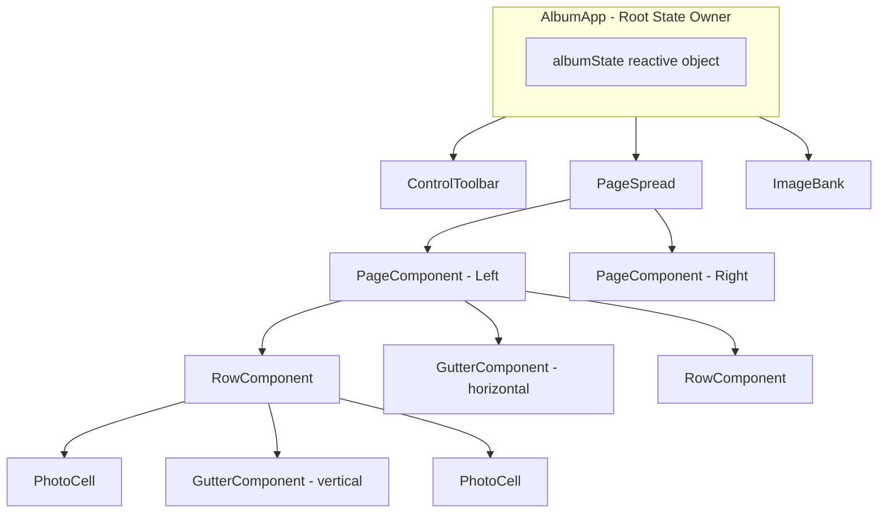

# Photobook Creator Application

## Architecture Overview



## Tech Stack

- **Build**: Vite with TypeScript
- **Framework**: Vue 3 Composition API
- **Styling**: CSS with Bootstrap 5 (icons only, minimal utility use)
- **Dependencies**: Split.js (resizing), exifr (EXIF parsing)
- **Theme**: Clean & minimal light theme (white/gray, subtle shadows)

## Project Structure

```
photobook/
├── index.html
├── package.json
├── vite.config.ts
├── tsconfig.json
└── src/
    ├── main.ts
    ├── App.vue
    ├── config.ts                 # CONFIG constants
    ├── types.ts                  # TypeScript interfaces
    ├── composables/
    │   ├── useFileSystem.ts      # showDirectoryPicker, read/write album.json
    │   ├── useImageBank.ts       # EXIF sorting, image state management
    │   └── useCropCalculation.ts # Pure functions from prototype
    ├── components/
    │   ├── ControlToolbar.vue
    │   ├── PageSpread.vue
    │   ├── PageComponent.vue
    │   ├── RowComponent.vue
    │   ├── PhotoCell.vue
    │   ├── GutterComponent.vue
    │   └── ImageBank.vue
    └── styles/
        └── main.css
```

## Implementation Plan

### Phase 1: Project Setup

- Initialize Vite + Vue 3 + TypeScript project
- Install dependencies: `split.js`, `exifr`, `bootstrap-icons`
- Create `config.ts` with all dimension constants from spec
- Create `types.ts` with TypeScript interfaces for album.json structure

### Phase 2: Core Logic Migration

Port the working logic from [`grid_crop/00_opus_45.html`](grid_crop/00_opus_45.html):

- **`useCropCalculation.ts`**: Extract `calculateCrop()`, `computeMinScale()`, `zoomAboutPoint()`, `clampTranslate()`, `applyTransform()` as pure functions
- **Split.js integration**: Keep the proven resize approach, adapt for Vue's reactive system

### Phase 3: File System & Persistence

- **`useFileSystem.ts`**: Implement `showDirectoryPicker()` workflow
  - Scan for JPG files
  - Load existing `album.json` or create default (left: "3-2", right: "2-3")
  - Auto-save on mutations
  - Handle missing images gracefully

### Phase 4: Vue Components

Build components following the spec's hierarchy:

1. **AlbumApp** (root): Owns `albumState`, handles all mutations
2. **ControlToolbar**: Navigation arrows, add/delete/move spread buttons
3. **PageSpread**: Container for left/right pages + page counter
4. **PageComponent**: Single page with layout switcher icon, renders rows
5. **RowComponent**: Renders cells with vertical gutters between them
6. **PhotoCell**: Drop target, displays cropped image or placeholder, crop mode UI
7. **GutterComponent**: Reusable horizontal/vertical resize handle using Split.js
8. **ImageBank**: Bottom panel with EXIF-sorted thumbnails, drag source

### Phase 5: Image Bank & EXIF Sorting

- **`useImageBank.ts`**: 
  - Read all JPGs from directory
  - Extract EXIF DateTimeOriginal using `exifr`
  - Sort: images with EXIF by date, then images without by filename
  - Track used/unused state
  - Calculate thumbnail widths maintaining aspect ratio at 150px height

### Phase 6: Drag & Drop

Implement native HTML5 drag/drop:
- Drag from bank to cell (auto-crop on drop)
- Drag between cells (swap)
- Drag from cell to bank (remove)
- Visual feedback during drag operations

### Phase 7: Layout Switching

Implement the layout change logic from spec:
- Layouts: "1", "2-2", "2-3", "3-2"
- Layout switcher icon (top-left for left page, top-right for right page)
- Smart image preservation when switching layouts
- Return excess images to bank

### Phase 8: Styling

Clean & minimal light theme:
- White page backgrounds with subtle shadows
- Light gray app background
- Subtle borders and shadows
- Blue accent for active states (crop mode, hover)

## Key Files Reference

- **Crop logic to port**: [`grid_crop/00_opus_45.html`](grid_crop/00_opus_45.html) lines 448-534 (transform functions)
- **Split.js setup**: [`grid_crop/00_opus_45.html`](grid_crop/00_opus_45.html) lines 786-819
- **Spec layouts**: [`prompt_full_v3_vue.md`](prompt_full_v3_vue.md) lines 44-57
- **album.json structure**: [`prompt_full_v3_vue.md`](prompt_full_v3_vue.md) lines 194-231